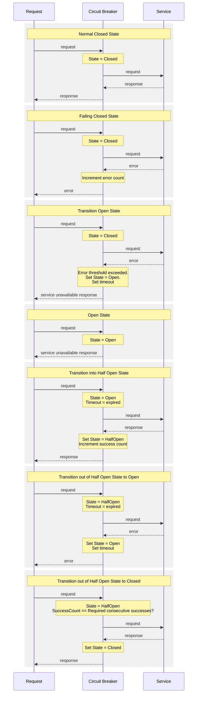

# Breaker Box

A collection of the circuit breaker pattern implemented in different programming languages.

## The pattern

A circuit breaker automatically detects failures in dependencies of a system. When a dependency is detected as failing, the circuit breaker prevents traffic from being sent to the service, while periodically sampling a small percentage of traffic to verify if the dependent service has recovered. This prevents cascading failures that can be caused by continuing to send traffic to a failing service.

## The approach

*Notes on Half Open behavior:* For our implementation, we transition the circuit breaker from Open to HalfOpen after a set duration the circuit has been open. When in the HalfOpen state, the circuit routes traffic to the dependent service. If N number of consecutive successes occur, the circuit will move to Closed. If any errors occur the circuit will move back to Open and the wait duration for the next HalfOpen attempt is reset.